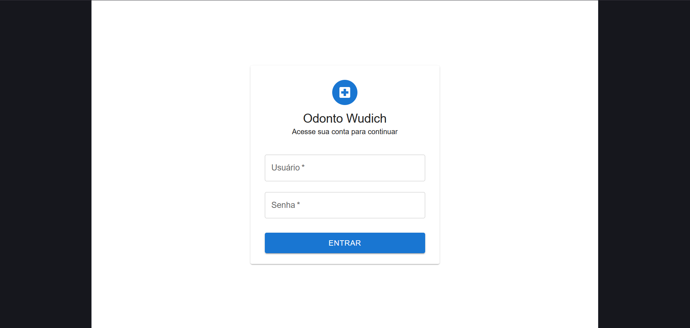
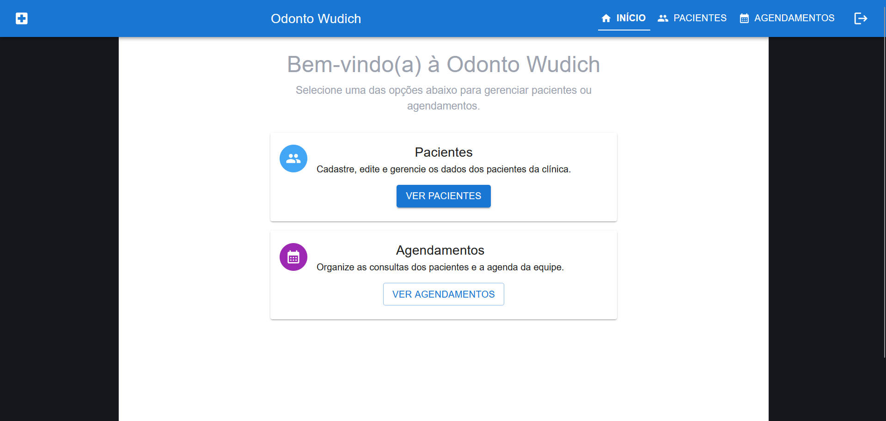
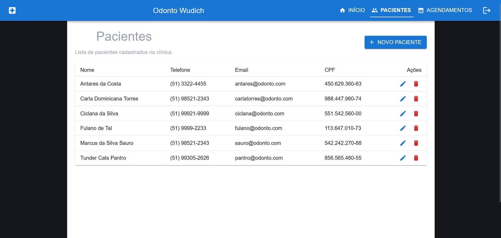
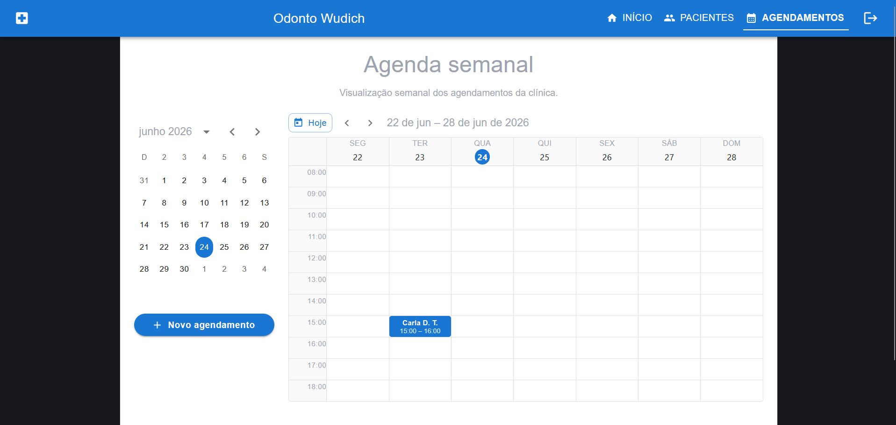

# Odonto Wudich – Frontend

Interface web para o sistema odontológico Odonto Wudich,
desenvolvida em React com Vite e Material UI.

---

## Tecnologias

- React
- Vite
- JavaScript ES6+
- Material UI (MUI)
- MUI X Date Pickers
- React Router DOM
- Fetch API

---

## Funcionalidades

- Login com username e senha
- Autenticação JWT com refresh automático
- Logout e proteção de rotas privadas
- Lista, cadastro e edição de pacientes
- Máscara de CPF e validação
- Máscara de telefone brasileiro
- Agenda semanal estilo Google Calendar
- Mini calendário mensal
- Criação e edição de agendamentos

---

## Estrutura do Projeto
src/ 
├── components/ 
│ ├── CpfField.jsx 
│ ├── Layout.jsx 
│ ├── PhoneField.jsx 
│ └── calendar/ 
│ ├── AppointmentModal.jsx 
│ ├── MiniCalendar.jsx 
│ └── WeekGrid.jsx 
├── pages/ 
│ ├── LoginPage.jsx 
│ ├── HomePage.jsx 
│ ├── PatientsPage.jsx 
│ ├── PatientFormPage.jsx 
│ ├── AppointmentsPage.jsx 
│ └── AppointmentFormPage.jsx 
├── services/ 
│ └── api.js 
├── utils/ 
├── dayjsConfig.js 
└── App.jsx theme.js main.jsx

---

## Rotas da Aplicação

| Rota | Descrição |
|---|---|
| `/login` | Tela de login |
| `/home` | Dashboard inicial |
| `/patients` | Lista de pacientes |
| `/patients/new` | Novo paciente |
| `/patients/:id/edit` | Editar paciente |
| `/appointments` | Agenda semanal |
| `/appointments/new` | Novo agendamento |
| `/appointments/:id/edit` | Editar agendamento |

---

## Autenticação

O fluxo de autenticação está implementado em `src/services/api.js`:

- login via `POST /api/users/token/`
- tokens salvos no `localStorage`
- refresh automático via `POST /api/users/token/refresh/`
- redirecionamento para `/login` se o refresh falhar

---

## Como Rodar
```bash
cd odonto-wudich-frontend
npm.cmd install
npm.cmd run dev
```


Frontend disponível em: `http://localhost:5173/`

O backend deve estar rodando em: `http://127.0.0.1:8000/`

---

## Telas Principais

### Login


### Dashboard


### Lista de Pacientes


### Agenda Semanal


---

## Segurança no Frontend

- Rotas privadas com redirecionamento para login
- Token enviado no header `Authorization: Bearer`
- Refresh automático em caso de expiração
- Logout limpa os tokens do localStorage

---

## Próximas Melhorias

- Identidade visual com logo própria
- Paleta de cores personalizada
- Favicon customizado
- Testes de componentes

---

## Autor

**M@rkitowb**
Desenvolvedor Python | Django | React

- GitHub: [https://github.com/markitowb](https://github.com/markitowb)
- LinkedIn: [https://www.linkedin.com/in/marcusviniciuswb](https://www.linkedin.com/in/marcusviniciuswb)